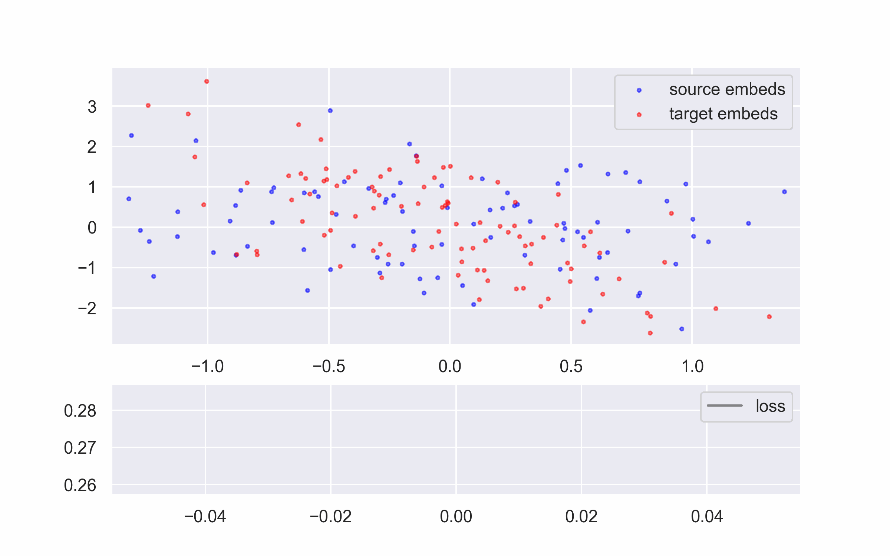
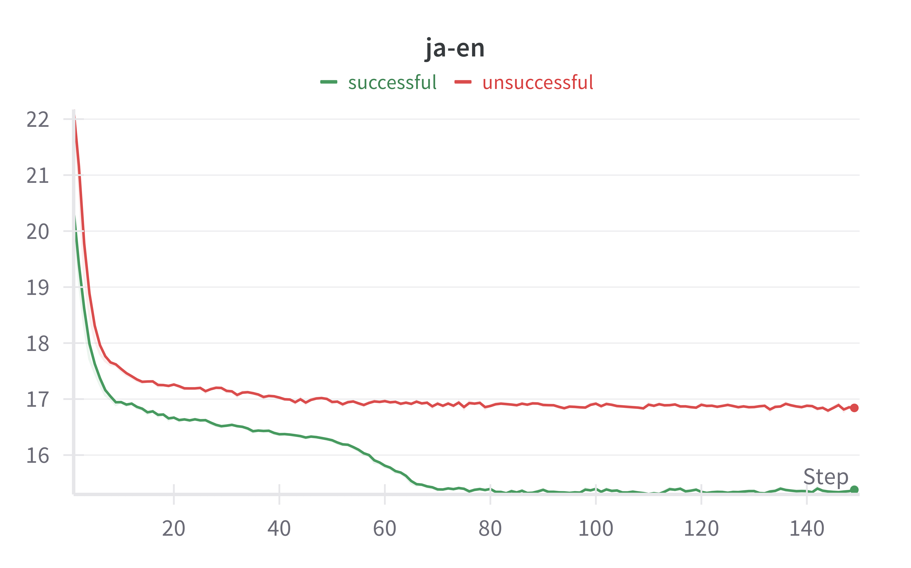
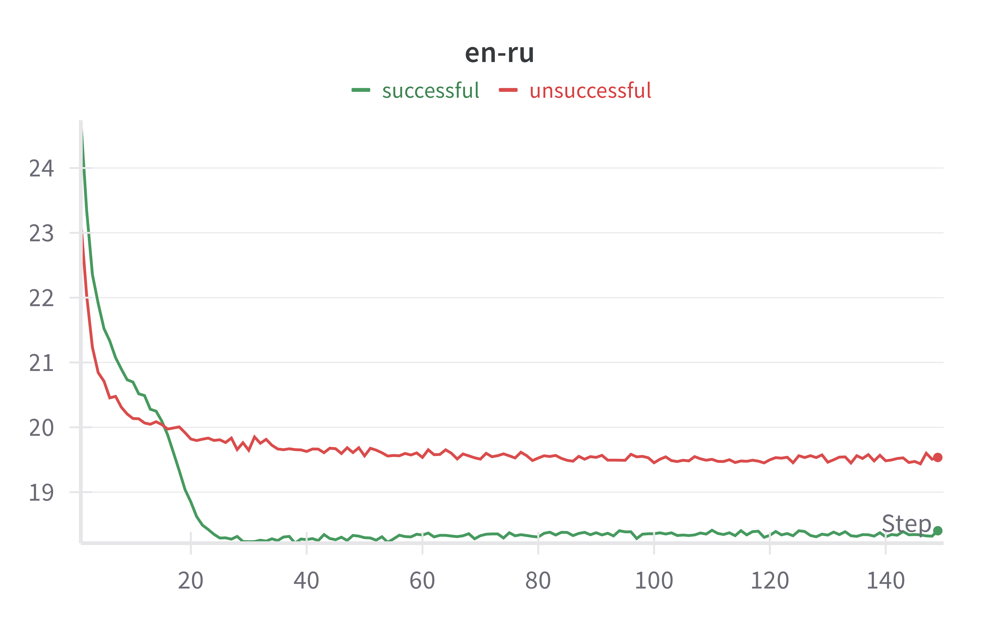

# Report

### Overview

This translation pipeline consists of two stages:

1. Word-by-word translation performed by a model with signle linear layer without bias. It is trained using a modified mini-batch iterative closest point algorithm introduced in ([Hoshen and Wolf, 2018](https://arxiv.org/abs/1801.06126))
2. Text-correction which makes the output of the first stage more readable and fixes minor mistakes (replacing words with more suitable synonyms, for example)

### Word-by-word translation

Let $\mathcal{X},\mathcal{Y}\in \mathbb{R^{n\times d}}$ be embedding matrices of source and target language. Here we use default fasttext embeddings with $d=300$ which can be found [here](https://fasttext.cc/docs/en/crawl-vectors.html) or downloaded using `utils.load_fasttext_data` . We load $n=10000$ or $n=20000$ embeddings, sort them in ascending order of Euclidean norm and leave top $5000$. After that we find same words in both languages (which are mostly numbers and punctuation) and perform Procrustes mapping from source to target and backwards:

$$
||X_\mathsf{same}W_{xy}-Y_\mathsf{same}||_F\to \min\limits_{W_{xy}\in O(d)}\\
||X_\mathsf{same}-Y_\mathsf{same}W_{yx}||_F\to \min\limits_{W_{yx}\in O(d)}
$$

where $X_{\mathsf{same}}$ and $Y_{\mathsf{same}}$ are embeddings of the coinciding words in the same order and $O(d)$ is a group of all orthogonal matrices of order $d$.

Main model that performs translation consist of two independent linear layers without biases: one performs translation from source language to target, another — in opposite direction. Both of them are initialized with $W_{xy}$ and $W_{yx}$ obtained by Procrustes mapping. 

During training at each epoch we:

1. Find nearest neighbors $\hat{\mathcal{X}}$ for source and $\hat{\mathcal{Y}}$ for target embeddings among target and source embeddigns respectively
2. Split the embeddings into random batches of fixed size: $X_1,X_2,...,X_b$ and $Y_1,Y_2,...,Y_b$
3. Map each embedding in the batch to its nearest neighbor in other language. Denote by $\widetilde{Y}_i$ batch of the closest embeddings to the ones from $X_i$ and similarly $\widetilde{X}_i$ for $Y_i$
4. Calculate the mapping losses: distances from embeddings in one domain to its closest neighbors in the other domain:
    
    $$
    \mathsf{map}_x=||X_iW_{xy}-\widetilde{Y}_i||,\ \mathsf{map}_y=||Y_iW_{yx}-\widetilde{X}_i||
    $$
    
5. Calculate reconstruction loss:
    
    $$
    \mathsf{rec}=||X_iW_{xy}W_{yx}-X_i||+||Y_iW_{yx}W_{xy}-Y_i||
    $$
    
    Reconstruction loss forces coherent translation in both directions. It ensures that if $y_i$ is the translation of $x_i$, then $x_i$ is the translation of $y_i$. In other words it is similar to the constraint of $W_{xy}W_{yx}=W_{yx}W_{xy}=I$, but applied only for separate batches (and in practice these products don’t differ from identity matrices much). Higher values of $\lambda$ can lead to solutions closer to orthogonal ones, but experiments has shown that accuracy falls in such cases, since languages are not entirely similar.
    
6. Total loss is 
    
    $$
    \mathcal{L}=\mathsf{map}_x+\mathsf{map}_y+\lambda \cdot \mathsf{rec}
    $$
    

---

You can see the visualisation of this algorithm on randomly generated 2d data. Source embeddings $X$ and weight $W$ were sampled from normal distribution, while target embeddings were obtained by $XW$. Noise wasn’t added in sake of clearer visualization, but in practice there is obviously no a mapping that gives an exact overlapping:


<div style="text-align: center;">

  

</div>


Visualization for real data is less informative, due to higher dimensinality: even though the intrinsic dimension is much lower than embedding dimension (around 10-12 for the most pairs, gorwing to 50-60 for Javanese and Punjabi), still to much information is lost while projecting embeddigns on the plane. More detailed information about dimensionality and geometry of different language embeddings is presented in the table below (suffix _ns means that it was calculated for embeddings that were previously sorted by norms):

|  | anisotropy | anisotropy_ns | intrinsic_dimension | intrinsic_dimension_ns | mean_norm | mean_norm_ns | std_norm | std_norm_ns |
| --- | --- | --- | --- | --- | --- | --- | --- | --- |
| it | 0.039 | 0.044 | 13.351 | 14.462 | 3.543 | 3.236 | 0.573 | 0.232 |
| en | 0.044 | 0.07 | 10.24 | 13.121 | 4.406 | 4.06 | 0.611 | 0.329 |
| fr | 0.042 | 0.055 | 12.248 | 13.719 | 3.55 | 3.24 | 0.505 | 0.223 |
| ru | 0.035 | 0.04 | 9.841 | 11.541 | 3.913 | 3.569 | 0.519 | 0.271 |
| zh | 0.053 | 0.065 | 20.754 | 15.589 | 2.771 | 2.582 | 0.63 | 0.268 |
| es | 0.04 | 0.054 | 11.889 | 13.857 | 3.597 | 3.269 | 0.528 | 0.239 |
| ja | 0.048 | 0.055 | 17.894 | 12.835 | 3.371 | 3.087 | 0.515 | 0.264 |

We can see that norm sort makes intrinsic dimension of input embeddings larger (at least for European languages), resulting in more informative inputs. Anisotropy is increased as well indicating that embeddings become more aligned along a single direction which potentially could make the embedding transfer easier.

<!-- - Anisotropy calculation
    
    Let $X\in\mathbb{R}^{n\times d}$ be a set of $n$ points in $d$-dimensional space. Firstly, we need to recenter these points by $X^*=X- I\mu$, where $\mu$ is a column vector of mean values of coordinates for all points and $I$ is a $n\times n$ identity matrix. Then we calculate its covariance matrix $C=n^{-1}(X^*)^TX^*$. Let $\lambda_1<\lambda_2<...<\lambda _d$ be its eigenvalues, then anisotropy is
    
    $$
    \mathsf{anisotropy}(X)=\cfrac{\lambda _d}{\sum\limits_{i=1}^d\lambda _i}
    $$
    
    As it follows from formulation, this value shows how much large is the maximum eigenvalue, normed by the sum of all of them. The higher this value is, the more these points are stretched along one direction (specifically, the eigenvector corresponding to the largest eigenvalue) -->
    

<details>
  <summary>Anisotropy calculation</summary>
  
  Let \(X \in \mathbb{R}^{n \times d}\) be a set of \(n\) points in \(d\)-dimensional space. Firstly, we need to recenter these points by \(X^* = X - I \mu\), where \(\mu\) is a column vector of mean values of coordinates for all points and \(I\) is an \(n \times n\) identity matrix. Then we calculate its covariance matrix \(C = n^{-1}(X^*)^T X^*\). Let \(\lambda_1 < \lambda_2 < \ldots < \lambda_d\) be its eigenvalues, then anisotropy is:

  $$
  \text{anisotropy}(X) = \frac{\lambda_d}{\sum_{i=1}^d \lambda_i}
  $$

  As it follows from the formulation, this value shows how much larger is the maximum eigenvalue, normed by the sum of all of them. The higher this value is, the more these points are stretched along one direction (specifically, the eigenvector corresponding to the largest eigenvalue).

</details>

---

One of the nice things about this task is that local minima is noticably higher that global ones, which was noticed in the original paper and confirmed even with these changes of the initialization. Moreover, successful algorithm run always has the sudden loss decrease at some point during training. This phenomena stays even for very different language pairs (like Japanese-English) that don’t share much similar grammar and word formation. You can see the examples of unsuccessful and successful runs with phase shifts for different language pairs below (unsuccessful were obtained without Procrustes initialization):

<div style="text-align: center;">

  
  

</div>


---

During training I conducted many experiments with architecture of this algorithm as well. One of the ideas was to split word embeddings of both languages into the same number of clusters and sort them based on some metric (for example, average norm of the word, number of words, intrinsic dimension and anisotropy) and then while finding nearest neighbor for the word $x_i$ among target words $Y$, we would look only at the words in the corresponding cluster. Unfortunately, it didn’t lead to any improvements because smaller number of clusters couldn’t give any useful information and larger number led to noisy results.

Another attempt to increse accuracy and convergence speed was done by setting the dynamic batch size. The logic behind this is simple: larger batch sizes lead to smaller weights updates on the each step, while smaller ones add stochasticity and result in faster convergence. Initially we want to make larger noisy steps hoping to catch the path to the global minima — in some sense it replaces the approach done by authors in the original paper, where they performed many runs for each pair with different random initializations. But as it turned out, introducing more stochasticity only weakens the control over the convergence so it’s more reasonable to use fixed-size batches, especially since the Procrustes initialization eliminates the need for large amount of runs.

---

During inference some heuristics are used in order to obtain high-quality translaiton for entire sentences. All punctuation is deleted, except for apostophes (they play major role in the translation from French, for example) and question and exclamation marks, also all words are set to the lower case. Since word-by-word translation usually is not able to provide exact translation for digits and numbers (it can translate ‘2014’ as ‘2017’), they are skipped and sent to the output right away.

Main improvements of the original paper on ICP usage are:

1. Sorting embeddings in order of their norms, not by default fasttext order (number of occurences in training data). It allowed to exclude outlier words which prevented model from convergence by “magnetizing” embeddings to wrong neighbors and left more similar words in source and target data, which is crucial for the successful convergence.
2. Initializing model parameters with Procrustes mapping matrices led to much better start of a learning process so there is no need in many different runs (for the most pairs single run was sufficient in comparison with 500 in the original paper).
3. Entire translation pipeline performed in a single stage, opposed to three stage before (in the first stage PCA was applied to decrease dimension to 50, then ICP is performed resulting in a set of pairs $(x_i,y_i)$ such that $x_i$ maps to $y_i$ and backwards. These pairs were used as the initialization to full ICP on the second stage, and lastly Procrustes mapping is applied to final embeddings)
4. Succesfull translation for Asian-European pairs (for example, Japanese-English), which was not feasible with the original implementation. Note that Japanese language does not have spaces, so performing word-by-word translation *from* it not possible without manually separating input words.

### Text correction

Although word-by-word translation can be applied to texts in order to get the essence of the content, the result lacks proper grammar, punctuation, etc. In order to get nicer translation of texts I fine-tuned mt5 model using LoRA on manually created dataset with pairs (bad_text, good_text).

For that I loaded Wikipedia dumps in English and Russian (so the final model supports translation only to these languages for now), and manually degraded quality of texts by setting words to indefinite form, getting rid of punctuation, changing random words to their synonyms and shuffling random words in a fix-sized window. The final combined dataset can be found on [huggingface](https://huggingface.co/datasets/gudleifrr/text-correction-en). All the inputs are preceeded with a special token added to original tokenizer.

In addition to that there is a much smaller [model](https://huggingface.co/gudleifrr/text-correction-en-small) with 77M parameters (fine-tuned flanT5) which supports text-correction for English language only and provides satisfying results for simpler sentences. It was trained on a smaller part (around 10%) of the dataset mentioned above. Russian language is not supported due to the nature of the original model, which supports only 5 languages and Russian is not among them.

### Results and conclusion

Here are some examples of translation at work (`<NULL>` tokens indicates that there is no such word among fasttext data, they are replaced by the most suitable one during text-correction):

1. Russian to English:
    
    ---
    
    **original text:** Моя кошка любит спать на подоконнике, особенно когда солнечные лучи проникают в комнату, согревая её шерстку и создавая уютную атмосферу.
    **wbw translation:** my dog loves sleep on windowsill especially when bright rays infiltrated in room <NULL> her <NULL> and creating cozy atmosphere
    **final translation:** My dog loves sleeping on windowsill, especially when bright rays infiltrate into her room, giving her a soothing and creating a cozy atmosphere.
    
    ---
    
    **original text:** Сегодня я пошел в школу и занимался там математикой
    **wbw translation:** today i came in school and worked here math
    **final translation:** Today I went to school and worked in mathematics.
    
    ---
    
    **original text:** Вчера вечером я посмотрел интересный фильм о космических путешествиях, который заставил меня задуматься о бесконечности Вселенной и возможных формах жизни на других планетах.
    **wbw translation:** yesterday evening i looked interesting movie if intergalactic journeys which wanted myself think if infinite universe and potential forms life on other planets
    **final translation:** Yesterday evening I looked at an interesting movie, called Intergalactic Journeys, which wanted myself to think about the infinite universe and the potential forms of life on other planets.
    
2. English to Japanese:
    
    ---
    
    **original text:** Despite the unpredictable weather, the determined hikers set out early in the morning, equipped with all necessary gear, to conquer the challenging trail that wound through the dense forest and up the steep mountain slopes.
    
    **wbw translation:** ものの の シビア 気候 の 決め サイクリスト 決め 周り 夕方 の の 夕方 備え 含め たくさん 必要 ハーネス <NULL> 征服 の 難しい サイクリングロード たら 治っ を通して の 分厚く 木々 し 周り の なだらか 道路 山裾
    
    **reference*:** Despite the severe weather, the determined cyclists decided to go around in the evening, including a lot of necessary harnesses <NULL> to conquer the difficult cycling road, through the dense trees and around the gentle roads of the mountain foothills.
    
3. French to Russian:
    
    ---
    
    **original text:** Malgré les difficultés de la vie, elle continue de poursuivre ses rêves avec détermination et optimisme.
    
    **wbw translation:** несмотря этих трудности из в жизни он продолжает из продолжить своих мечты взяв решимость но оптимизма
    
    **final translation:** Несмотря на все трудности, которые он испытывал в жизни, он продолжал мечты. Он продолжал свои мечты, взяв решимость и оптимизма.
    
4. Italian to Russian:
    
    ---
    
    **original text:** Quando il sole tramonta, il cielo si colora di bellissimi toni rosa e arancioni.
    
    **wbw translation:** когда свой солнца выгорает свой небо он окрашивает с красивых тон голубой и светло-серый
    
    **final translation:** Когда свет солнца выгорает, небо он окрашивает в несколько красивых тонов: голубой и светло-серый.
    

---

*references are the backward translations performed by ChatGPT

---

I want to emphasize that entire translation is performed by models that were trained in unsupervised manner, without any parallel data. I ensured that there were no any data leaks at each step, for that purpose the dataset for text correction was created without any information of the nature of word-by-word translation (input texts are not the outputs or wbw translation, but rather the outputs of the function that worsens the texts in target language). The only concern is on the training data of fasttext embeddings. According to the authors these embeddings were trained on CommonCrawl and Wikipedia, so there may be potential implicit data leak that originates from the fact that many Wikipedia articles are multilingual, therefore fasttext embeddings could gain some multilingual information by learning word representations of the data with similar contents in different languages. But considering the size of the entire dataset (including CommonCrawl), we can be pretty sure that these embeddings reflect real language statistics and such data leak is not a significant problem.

### Further steps

1. Word-by-word translation is prone to misusing some synonyms or similar words (e.g. translate ‘второй’ as ‘first’ instead of ‘second’), one step to prevent this is generate several possible wbw translations for each word, run all possible sentences through the text-correction model and choose the most probable one as the final translation. This can significantly slower the translation, but will provide better results.
2. There can be entirely different approach to text-correction with utilizing decoder models instead of encoder-decoder. We can generate $k$ possible translations for each word and combine them into a single input using <SEP> token. For example, having input sentece like `“Меня радует солнце”`, performing wbw translation we can get a list `[[’I’, ‘me’, ‘mine’], [’joy’, ‘gladden’, ‘fun’], [’sun’, ‘moon’, ‘sunlight’]]` and hence input will look like this:
    
    ```
    input = I me mine <SEP> joy gladden fun <SEP> sun moon sunlight
    target = I enjoy sunlight
    ```
    
    This will require larger context window size, expecially for longer sentences and larger values of $k$, but it will provide the model with more information about the true meaning of the sentence.
    
3. Also, we can filter not suitable word-by-word translation candidates using a decoder model by sequentially choosing the next most probable token among $k$ candidates from wbw translation results. Then this slightly more informative version of word-by-word correction is passed to text-correction model. The accuracy for the tokens in the begging of the sentence can be low due to small context but still it seems like the promising enhancement of this pipeline among those that don’t require larger models.
4. Current approach involves two-stage tranlsation, which suggests that the next step is to combine them into end-to-end translation pipeline (word-by-word translation and text-correction are done simultaneusly inside a single model), especially it would be useful since attention mechanism will potentially enhance the word-by-word translation. Alas, I don’t have working ideas on how to combine them, since wbw stage requires the information about the entire language, but training text correction model relies solely on supervised examples.
5. Although text correction stage significantly improves translation, sometimes model can halucinate in some sense and add text that differs too much from the truth. One step to make this better is to recreate dataset with less ‘harsh’ actions to worsen texts. For example, make a window in which words are randomly shuffled narrower and don’t remove dots. Also, more careful approach to chosing synonyms would improve this stage: the original dataset is a Wikipedia dump, so there are many texts rich with proper names, dates and factual information that is very sensitive to changing to synonyms, which probably made model training harder and it did not fully learnt possible improvement of texts.
6. Lastly, not much work needs to be done to broaden the amount of possible target languages (for now it’s only Russian and English). After changing function of text worsening based on the advices above, one can follow the source code to fine-tune model for any other language.